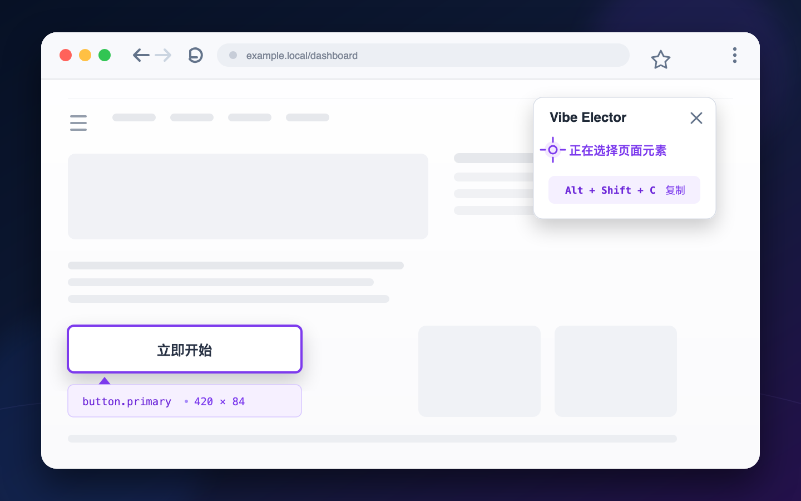
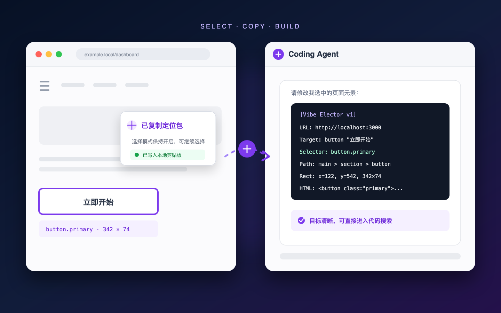

<p align="right">
  <strong>English</strong> | <a href="README_zh-CN.md">简体中文</a>
</p>

# Vibe Elector

A Firefox element selector built for Coding Agents. Click any page element and copy a compact, stable context packet directly into an AI coding conversation—so your agent knows exactly which button, panel, or field you mean.

## Why Vibe Elector

- **Built for Coding Agents:** Copies the URL, element summary, selector, DOM path, dimensions, and a safe HTML signature instead of dumping the entire DOM.
- **More reliable targeting:** Prefers stable IDs, test attributes, and semantic attributes; falls back to structural paths and supports open Shadow DOM selectors with `>>>` segments.
- **Fast repeated selection:** Copying automatically unlocks the current target while keeping selection mode active.
- **Local-first:** No network requests, telemetry, or stored page data. Selection packets only go to your local clipboard.

## How to Use

### 1. Select and lock an element

Click the Vibe Elector toolbar icon or press `Alt + Shift + E`. Move the pointer to preview elements, then click to lock the target.



### 2. Copy the selection packet

Click **Copy to chat** in the floating panel or press `Alt + Shift + C`. After a successful copy, the target unlocks and selection mode stays active.

### 3. Paste it into a Coding Agent

Paste the packet together with your request into Codex, Claude Code, Cursor, or another coding tool. The agent can use the selector and context to locate the target directly.



Example packet:

```text
[Vibe Elector v1]
URL: http://localhost:3000
Title: Dashboard
Target: button "Get Started"
Selector: button.primary
Path: main > section > button
Rect: x=122, y=542, width=342, height=74
HTML: <button class="primary">Get Started</button>
```

Click the toolbar icon, press `Alt + Shift + E` again, or use the panel close button to exit selection mode.

## Build and Install

Requirements: Firefox Desktop, Node.js `22.17.1`, and pnpm `10.15.1`.

```bash
nvm use
pnpm install --frozen-lockfile
pnpm build:firefox
```

Open `about:debugging#/runtime/this-firefox` in Firefox, choose **Load Temporary Add-on**, and select:

```text
.output/firefox-mv3/manifest.json
```

Alternatively, launch a test browser from the command line:

```bash
pnpm exec web-ext run --source-dir .output/firefox-mv3 --no-reload
```

> `pnpm dev:firefox` is not currently recommended because the Firefox Manifest V3 development runner in WXT `0.20.9` has a startup compatibility issue.

## Keyboard Shortcuts

| Action | Shortcut |
| --- | --- |
| Toggle selection mode | `Alt + Shift + E` |
| Copy the locked selection | `Alt + Shift + C` |

If a shortcut conflicts with another extension, rebind it from Firefox's extension shortcut settings in `about:addons`.

## Support and Limitations

- Supports HTTP, HTTPS, localhost, and user-authorized `file://` pages.
- Supports regular DOM and open Shadow DOM. A closed Shadow DOM can only be targeted through its host.
- Does not enter iframes; the `<iframe>` element itself can still be selected.
- Firefox system pages, `about:*`, AMO, and other restricted pages do not allow script injection.
- The MVP does not include history, accounts, cloud sync, screenshots, or source maps.

## Privacy and Permissions

Vibe Elector does not upload or persist page content. Password values are excluded, and HTML signatures retain only safe attributes. It uses `activeTab`, `scripting`, and `clipboardWrite`; access to `file://` is requested only when needed. See [PRIVACY.md](PRIVACY.md) for details.

## Development

```bash
pnpm test          # Run the Vitest suite
pnpm typecheck     # Check strict TypeScript types
pnpm build:firefox # Build the Firefox MV3 extension
pnpm lint          # Type-check and run web-ext lint
```

The project uses WXT, strict TypeScript, native DOM/CSS, Shadow DOM, Vitest, and `happy-dom`. Read [AGENTS.md](AGENTS.md) before contributing and [SOURCE_BUILD.md](SOURCE_BUILD.md) for reproducible build details.

## License

This project is licensed under the [MIT License](LICENSE).
